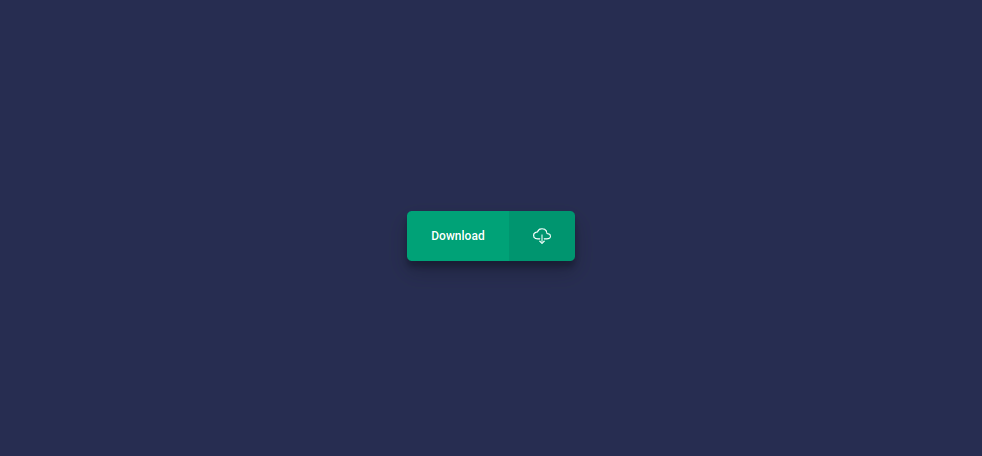

# Button with icon

## Features

- button with icon
- shadow around button
- "press" effect on click

## Technologies used

- HTML
- CSS

## Credits:

- Google Fonts - [Roboto](https://fonts.google.com/specimen/Roboto?query=roboto)
- ionicons - [cloud-download-outline icon](https://ionic.io/ionicons)

## Preview

Live demo: [click here](https://pawelpohland.github.io/button-with-icon/)

